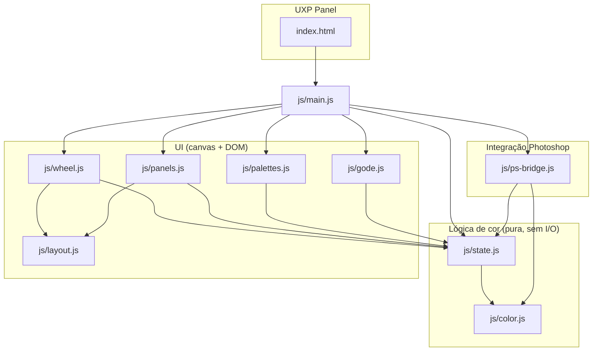

# Design Document — Color Wheel Plugin

## Overview

O Color Wheel Plugin é um painel UXP para Adobe Photoshop (v24+) que replica a experiência do Coolorus: roda HSV com seletor triangular interno, esquemas de harmonia, sliders multi-modo, mixer, dials de brilho/temperatura, indicador de gamut, histórico, limitador de matiz, rampa B/W e um godê de mistura de pigmentos, tudo sincronizado bidirecionalmente com as cores de foreground/background do Photoshop.

A estratégia de implementação é de **reaproveitamento direto**, não reescrita. O diretório `demo/` contém uma implementação em navegador cuja matemática de cor e de geometria já foi validada por `verify-color-math.js` (round-trips HSV↔RGB, RGB↔LAB, RGB↔CMYK, geometria do triângulo/quadrado/disco, quantização de matiz, rampa B/W, travamento de luminosidade, máscara de gamut). Os módulos `color.js`, `state.js`, `wheel.js`, `panels.js`, `palettes.js` e `gode.js` são portados quase sem alteração para o plugin UXP — mesmo estilo (IIFE anexado a `window`, comentários em pt-BR, sem build step, sem TypeScript). O que muda é a casca: `index.html` roda dentro de um `<uxp-panel>` em vez de uma aba de navegador, e uma camada nova (`ps-bridge.js`) substitui a simulação de Photoshop do demo pela API real (`photoshop.app.foregroundColor`/`backgroundColor`).

Duas decisões de escopo foram confirmadas com o usuário e valem para todo este documento:

1. **Sem editor de arranjo por arraste.** O Layout_De_Referência definido em `layout-parity-editor` (Requisitos 1 a 7: Reference_Space 628×907, Wheel_Center, raios, tabela de âncoras, Theme_Tokens) é adotado como geometria **fixa** do painel. O Modo_De_Organização, Layout_Editor, Snap_Engine, Layout_Store e Layout_Serializer (Requisitos 8 a 12 daquele spec) **não fazem parte** deste plugin — `layout.js` é portado apenas com `ANCHORS`, `anchorToPoint`/`pointToAnchor` e `applyLayout`/`Scale_Controller`, sem o código de edição.
2. **Sem docking próprio.** O recurso de `docking.js` (destacar uma aba em janela flutuante arrastável/redimensionável dentro do `demo-shell`) é **removido**. Painéis UXP já são docáveis e flutuantes pelo próprio sistema de painéis do Photoshop — reimplementar isso por cima seria redundante e não se sustenta bem dentro do modelo de janela do UXP (que não expõe janelas-filhas arbitrárias como um browser). O botão "⤢ Separar em janela" e a aba correspondente não existem no plugin real.
3. **Mixer_Panel usa o desenho strip-based do demo, não o do requirements.md literal.** O Requisito 5 descreve um mixer simples de 2 swatches + slider de proporção. A aba "Mixers" já implementada no demo (Color history, Blender, Shades & tones, Swatches, Scheme — 5 faixas no estilo Coolorus) é mais rica e já funciona; ela é adotada como a interpretação real do Requisito 5, e as amostras intermediárias entre duas cores (5.2/5.4) mapeiam para a faixa "Blender". Esta é uma reinterpretação assumida do requisito, registrada aqui para rastreabilidade.

## Architecture



Isso atende ao Requisito 13.6 (mínimo 3 módulos por responsabilidade) com margem: **UI** (`wheel.js`, `panels.js`, `palettes.js`, `gode.js`, `layout.js`, `main.js`), **lógica de cor** (`color.js`, `state.js`), **integração com Photoshop** (`ps-bridge.js`). `state.js` fica na camada de lógica porque não toca DOM nem UXP — é estado puro com um mecanismo de `subscribe`/`emit`, o mesmo padrão pub-sub do demo.

### Estrutura de arquivos

```
color-wheel-plugin/
├── manifest.json
├── index.html
├── styles.css
├── icons/
│   └── icon.png            (ícone do plugin exigido pelo manifest)
└── js/
    ├── color.js             — portado sem alteração de lógica
    ├── state.js              — portado sem alteração de lógica
    ├── layout.js              — portado, removida a parte de editor (Requisitos 8-12 do layout-parity-editor)
    ├── wheel.js               — portado sem alteração de lógica
    ├── panels.js              — portado, adaptado para Mixer_Panel strip-based (já é o formato do demo)
    ├── palettes.js            — portado sem alteração de lógica
    ├── gode.js                — portado sem alteração de lógica
    ├── ps-bridge.js           — NOVO
    └── main.js                — portado, adicionada wiring do ps-bridge.js
```

`docking.js` não é portado. O `index.html` remove o botão `#detachBtn` e o `<script src="js/docking.js">`, e `main.js` remove a chamada a `Docking.init()`.

## Components and Interfaces

Para cada subsistema do Glossary do requirements.md: responsabilidade, funções-chave e origem (reaproveitado vs novo).

### Color_Wheel (Requisito 1)

**Responsabilidade:** renderizar o anel de matiz e converter entre ângulo de tela e matiz.

**Origem:** `demo/js/wheel.js`, função `buildRing()` (textura do anel via `ImageData`, um pixel por grau) e `render()` (composição do canvas). Detecção de clique: `toCanvasCoords`, `screenAngle`, `applyRing`.

**Principais funções (mantidas como estão):**
- `hueMarkerPos(hue, radius)` → `{x, y}` — posição do marcador para um matiz e raio dados.
- `screenAngle(point)` → graus (0 no topo, sentido horário) — inverso de `hueMarkerPos` para o mesmo raio.
- `applyRing(point)` — dado um ponto de clique, atualiza `AppState` com o matiz correspondente se o ponto estiver na faixa do anel; caso contrário, não faz nada (Requisito 1.6).

**Novo:** nada. A única adaptação é garantir que o canvas (`#wheel`) receba eventos de ponteiro compatíveis com UXP (`pointerdown`/`pointermove`/`pointerup` já são suportados nativamente pelo UXP WebView).

### Triangle_Selector (Requisito 2)

**Responsabilidade:** seletor de saturação/valor inscrito no anel, com suporte também a quadrado e disco (Requisito de forma alternativa já presente no demo, mantido como recurso extra do plugin).

**Origem:** `demo/js/wheel.js`, interface uniforme `SHAPES.triangle` / `SHAPES.square` / `SHAPES.disc`, cada uma expondo `pointToHsv`, `hsvToPoint`, `inside`, `clamp`, `trace`, `bounds`, `drivenBy`. Geometria de baixo nível: `triVertices`, `barycentric`, `baryToSv`, `svToPoint`, `clampToTriangle`.

**Novo:** nada.

### Harmony_Engine (Requisito 3)

**Responsabilidade:** calcular e posicionar marcadores secundários de harmonia.

**Origem:** `demo/js/state.js` — `HARMONY_SCHEMES` (os 5 esquemas com offsets fixos), `getHarmonyOffsets()`, `getHarmonyHues()`, `setScheme(id)`, `setHarmonyOffset(index, deg)` (permite ao usuário reajustar um marcador secundário e persiste o desvio por esquema), `resetHarmony()`. Renderização dos marcadores: `demo/js/wheel.js` (`render()`, desenho dos marcadores secundários) e `demo/js/main.js` (`buildArc`, `refreshArc` — os botões de seleção de esquema no arco superior direito).

**Novo:** nada.

### Slider_Panel (Requisito 4)

**Responsabilidade:** sliders numéricos multi-modo (RGB, HSV, LAB, CMYK, B/W).

**Origem:** `demo/js/panels.js` — `buildSliders()`, `valueFromPointer`, `quantize`, `commitChannel`, `wireSliderTrack`, `wireSliderInput`, `refreshSliders()`, `buildModeButtons()`. A definição de ranges e labels por modo já existe implicitamente na estrutura de dados consumida por `buildSliders`.

**Novo:** nada.

### Mixer_Panel (Requisito 5, reinterpretado — ver Overview)

**Responsabilidade:** mistura visual de cores em 5 faixas.

**Origem:** `demo/js/panels.js` — `initMixer()`, `initTrack(trackId, thumbId, onSample)`, `refreshMixer()`, `refreshHistoryBar()`, `refreshBlenderCanvas()`, `refreshShadesCanvas()`, `refreshSwatchesBar()`, `refreshSchemeCanvas()`, `feedMixerFromWheel()`. A interpolação linear em RGB que sustenta a faixa "Blender" vem de `color.js` — `mixRgb(c1, c2, t)`.

**Novo:** nada de lógica. O rodapé de import/export de barras (`#mixExport`/`#mixImport`) usa `localStorage` no demo; no plugin isso é adaptado para a API de armazenamento local do UXP (ver Data Models).

### Color_Preview / Hex_Display (Requisito 6)

**Responsabilidade:** swatch grande de preview e campo hex editável.

**Origem:** `demo/js/panels.js` — `initHex()`, `commitHex()`, `refreshHex()`. Conversão: `color.js` — `rgbToHex`, `hexToRgb`.

**Novo:** nada.

### BT_Controls (Requisito 7)

**Responsabilidade:** dials de brilho e temperatura.

**Origem:** `demo/js/panels.js` — `drawDial(cv, ratio, tint)`, `ratioFromPointer(cv, evt)`, `initDials()`, `refreshDials()`. Temperatura usa `AppState.setTempOffset(deg)` e `state.tempOffset`, que desloca o matiz na leitura (`getHsv()` combinado ao offset) sem alterar o H armazenado — isso é o que permite ao BT_Controls "resetar" o offset quando outro controle muda a cor (Requisito 7.7).

**Novo:** nada.

### Gamut_Indicator (Requisito 8)

**Responsabilidade:** avisar quando a cor selecionada está fora do gamut de impressão e oferecer correção.

**Origem:** `color.js` — `isOutOfGamut(r,g,b)`, `clipToGamut(r,g,b)` (busca binária em croma LAB até entrar no gamut, Requisito 8.3). Interface: `panels.js` — `refreshGamut()`, `initGamut()`.

**Novo:** a fonte do envelope de gamut. No demo, `maxChroma(L)` é uma curva aproximada fixa (comentário explícito no código: "Num plugin real isso viria do perfil ICC do documento"). No plugin, `ps-bridge.js` expõe uma função para ler o perfil CMYK do documento ativo e, quando disponível, `Color.isOutOfGamut`/`clipToGamut` devem usar esse perfil em vez da aproximação. Se nenhum perfil estiver configurado, o Gamut_Indicator cai no estado de erro do Requisito 8.5 (ver Error Handling) — a aproximação fixa do demo **não** é usada como substituto silencioso, para não mascarar a ausência de perfil.

### History_Manager (Requisito 9)

**Responsabilidade:** undo/redo de seleções de cor.

**Origem:** `demo/js/state.js` — `pushHistory()`, `canUndo()`, `canRedo()`, `undo()`, `redo()`, `sameColor()` (dedup consecutivo). Botões: `demo/js/main.js` — `initHistory()`, `refreshHistoryButtons()`.

**Novo:** nada.

### PS_Bridge (Requisito 10) — NOVO

**Responsabilidade:** ponte bidirecional entre `AppState` e as cores de foreground/background do Photoshop.

**Assinatura proposta (`js/ps-bridge.js`):**
- `init()` — carrega a cor de foreground atual do Photoshop e chama `AppState.setRgb(...)`; registra um listener de mudanças externas de cor; assina `AppState.subscribe` para propagar mudanças locais ao Photoshop.
- `pushForeground(rgb)` — envia `rgb` para `photoshop.app.foregroundColor`, com debounce de 50ms (Requisito 10.1).
- `pushBackground(rgb)` — equivalente para `backgroundColor`, usado por `swapForeground()` do `state.js`.
- `pullForeground()` → `Promise<{r,g,b}>` — lê a cor de foreground atual do documento.
- `isConnected()` → booleano — reflete se a última chamada à API UXP teve sucesso.
- `getCmykProfile()` → `Promise<perfil|null>` — lê o perfil CMYK do documento ativo (Requisito 11.7/11.8), usado pelo Gamut_Indicator.
- `onExternalColorChange(callback)` — assina eventos de mudança de foreground/background feitos fora do plugin (color picker nativo, eyedropper, ação), entregando a nova cor em RGB.

O debounce reaproveita o padrão de `commitChannel`/`wireSliderTrack` do demo (que já distingue "durante arraste" de "ao soltar", passando `commit:false`/`commit:true` para `AppState.setHsv`) — `ps-bridge.js` usa esse mesmo sinal de `commit` para decidir quando de fato chamar a API do Photoshop, em vez de implementar um debounce por timer solto.

### Color_Limiter (Requisito 14)

**Responsabilidade:** quantizar o anel de matiz em N segmentos rotacionáveis.

**Origem:** `demo/js/state.js` — `quantizeHue(h, steps)`, `quantizeLevel`, `applyLimit(hsv)`, `setLimit(patch)`, `getLimitedPalette()`. Rotação: `setWheelRotation(deg, snap)`, `nudgeWheelRotation`, `resetWheelRotation` (usadas tanto para a apresentação do anel quanto, no limitador, para o `Rotation_Offset`). Interface: `demo/js/panels.js` — `initLimit()`, `refreshLimit()`.

**Novo:** persistência local do estado (N, Rotation_Offset, habilitado) — ver Data Models e Requisito 14.18.

### BW_Ramp (Requisito 15)

**Responsabilidade:** escala discreta de cinzas perceptuais no modo B/W.

**Origem:** `demo/js/state.js` — `setBwSteps(n)`, `getBwRamp()` (distribuição uniforme em L*, conversão via `labToRgb(L,0,0)`). Interface: `demo/js/panels.js` — `initBwRamp()`, `refreshBwRamp()`.

**Novo:** persistência local de K (Requisito 15.13).

## Data Models

### Estado de cor (`AppState.state`, reaproveitado de `demo/js/state.js`)

```js
{
  hsv: { h, s, v },              // matiz 0-360, saturação/valor 0-100, ponto flutuante
  background: { r, g, b },        // 0-255
  scheme: 'none'|'comp'|'analog'|'triad'|'split'|'tetra',
  harmonyOffsets: { [schemeId]: number[] },
  sliderMode: 'RGB'|'HSV'|'LAB'|'CMYK'|'B/W',
  tempOffset: number,              // -60..60, deslocamento de apresentação do matiz
  wheelRotation: number,           // 0..360, apenas apresentação do anel
  shape: 'triangle'|'square'|'disc',
  lumLock: boolean, lockedL: number|null,
  gamut: { enabled, editing, locked, kind, cx, cy, rx, ry, angle },
  limit: { enabled, hueSteps, svSteps },   // Color_Limiter
  bwSteps: number,                          // K do BW_Ramp
  valueCheck: boolean,
  history: {h,s,v}[], historyIndex: number
}
```

Este objeto é a fonte única de verdade da UI. Nenhum componente lê ou escreve cor diretamente no Photoshop — tudo passa por `AppState`, e `ps-bridge.js` é apenas mais um assinante/publicador desse estado, exatamente como `wheel.js` e `panels.js`.

### Mapeamento para o UXP `SolidColor`

O módulo `photoshop` do UXP representa cores de foreground/background como instâncias de `SolidColor`, com sub-objetos `.rgb.red/green/blue` (0-255) e `.hsb.hue/saturation/brightness`. `ps-bridge.js` só troca RGB 0-255 com o Photoshop (nunca HSV diretamente, para evitar duas conversões redundantes já que `SolidColor.hsb` internamente arredonda para inteiro):

- **Enviar:** `AppState.getRgb()` → arredondar (fronteira de saída, Requisito 11.4) → construir `new photoshop.app.SolidColor()` com `.rgb.red/green/blue` → atribuir a `photoshop.app.foregroundColor` dentro de um `executeAsModal`/`batchPlay` conforme exigido pela API.
- **Receber:** ler `photoshop.app.foregroundColor.rgb` → `AppState.setRgb(r, g, b, { commit: true })`.

### Perfil CMYK

`getCmykProfile()` lê `app.activeDocument.colorProfileName` (ou, via `batchPlay`, o `documentID`/`colorProfile` quando o modo do documento for CMYK). Quando o documento não tem um perfil CMYK associado (RGB ou modo sem perfil), retorna `null`, e o Gamut_Indicator entra no estado de erro (Requisito 8.5/11.8).

### Persistência local

Reaproveita o padrão de `demo/js/palettes.js` (`localStorage`, chave versionada `colorWheelPlugin.palettes.v1`). No UXP, `localStorage` do WebView do painel é a API disponível e persiste por usuário/instalação — mesmo mecanismo, chaves adicionais:
- `colorWheelPlugin.limiter.v1` → `{ enabled, hueSteps, rotationOffset }` (Requisito 14.18)
- `colorWheelPlugin.bwSteps.v1` → `{ steps }` (Requisito 15.13)
- `colorWheelPlugin.palettes.v1` → inalterado, portado de `palettes.js`
- `colorWheelPlugin.mixerStrips.v1` → visibilidade e conteúdo das 5 faixas do Mixer_Panel (substitui o export/import manual do demo por persistência automática, já que não há mais um `docking`/janela separada para justificar exportação manual entre sessões)

## Fixed Layout Geometry

O painel usa o Reference_Space de 628×907 unidades definido em `layout-parity-editor` (Requisitos 1 a 7): Wheel_Center em (325, 352), raio externo 213, raio interno 178, e a tabela `ANCHORS` completa (ângulo + raio a partir do Wheel_Center) para cada satélite — arco de harmonias, trilho esquerdo (dials, travamento de luminosidade, conferência de valores), trilho de histórico, satélites de gamut/forma, campo hex e grupo de swatches. Os 16 Theme_Tokens (Requisito 6 daquele spec: `panel-bg`, `surface-raised`, `divider`, `button-face`, `button-face-end`, `icon-stroke`, `text-primary`, `text-dim`, `accent`, `input-bg`, `input-border`, `leader-line`, `tab-active-bg`, `tab-active-border`, `warn`, `focus`) são portados como variáveis CSS customizadas em `styles.css`, exatamente com os valores hexadecimais especificados.

`js/layout.js` é portado com `REFERENCE`, `ANCHORS`, `ADJACENT`, `anchorToPoint`, `pointToAnchor`, `computeScale`/`Scale_Controller` e `applyLayout`. A escala proporcional (Requisito 7 daquele spec) é mantida — painéis UXP são redimensionáveis pelo usuário dentro do sistema de docking do Photoshop, então o painel deve continuar reagindo a mudanças de largura como no demo (via `ResizeObserver`).

**Fora de escopo, explicitamente:** Layout_Editor, Modo_De_Organização, Snap_Engine, Layout_Store (perfis nomeados) e Layout_Serializer (export/import de layout) — Requisitos 8 a 12 de `layout-parity-editor`. Não existe alternância para "modo de organização", nem arraste de botões satélite, nem perfis de layout alternativos ao padrão. Qualquer código do demo relativo a isso (se algum existir em versões futuras de `layout.js`) não é portado.

## UXP-Specific Concerns

### manifest.json

Campos obrigatórios (Requisito 13.1), UXP manifest v5:

```json
{
  "id": "com.drawcolor.colorwheel",
  "name": "Color Wheel",
  "version": "1.0.0",
  "main": "index.html",
  "host": [{ "app": "PS", "minVersion": "24.0.0" }],
  "entrypoints": [
    {
      "type": "panel",
      "id": "colorWheelPanel",
      "label": { "default": "Color Wheel" },
      "minimumSize": { "width": 320, "height": 500 },
      "maximumSize": { "width": 1200, "height": 1400 },
      "preferredDockedSize": { "width": 314, "height": 907 },
      "icons": [{ "path": "icons/icon.png", "width": 23, "height": 23 }]
    }
  ],
  "requiredPermissions": {
    "localFileSystem": "request",
    "clipboard": "readAndWrite"
  },
  "manifestVersion": 5
}
```

`minimumSize.width` de 320 casa com `MIN_EFFECTIVE_WIDTH` de `layout.js`; `maximumSize.width` de 1200 casa com `MAX_EFFECTIVE_WIDTH`. Isso é validado com o UXP Developer Tool antes de qualquer distribuição (Requisito 13.1).

### Persistência do painel (Requisito 13.2)

Painéis com `entrypoints[].type: "panel"` já são registrados pelo próprio Photoshop no menu Plugins e reaparecem entre sessões sem código adicional — isso é comportamento padrão do host UXP, não algo que o plugin implemente.

### Versão mínima e gating (Requisito 13.3/13.4)

O campo `host[].minVersion` no manifest já impede a instalação em versões incompatíveis via o próprio instalador da Creative Cloud. Como salvaguarda em tempo de execução (caso o plugin seja carregado via UXP Developer Tool em uma versão não testada), `main.js` verifica `require('photoshop').app.hostVersion` (ou equivalente) no boot e, se inferior a 24, renderiza uma mensagem de incompatibilidade em vez do painel — sem lançar excover não capturada (Requisito 13.4).

### Acesso à API `photoshop`

`ps-bridge.js` importa o módulo host via `const { app, core, action } = require('photoshop');`. Leitura/escrita de `foregroundColor`/`backgroundColor` não exige `executeAsModal` (são propriedades síncronas do `app`), mas mudanças que afetam o documento (nenhuma neste plugin) exigiriam. Eventos de mudança externa de cor são observados via `require('photoshop').action.addNotificationListener(['set'], handler)`, filtrando notificações cujo `descriptor` afete `foregroundColor`/`backgroundColor` (batchPlay event `"set"` com `null` target de `foregroundColor`).

### Debounce de escrita (Requisito 10.1)

Reaproveita o sinal `commit` já presente em `AppState.setHsv(next, { commit })`. Durante arraste contínuo (wheel, triângulo, dials, sliders), `commit` é `false` e `ps-bridge.js` não escreve no Photoshop a cada frame — apenas agenda uma escrita via `setTimeout` de 50ms que é cancelada e reagendada a cada novo evento `color`, e disparada de qualquer forma no `commit: true` (soltar o botão). Isso é o mesmo debounce por "reset de timer", não uma essência nova: nenhuma dependência externa é necessária.

### Perfil CMYK (Requisito 11.7/11.8)

Ver Data Models → Perfil CMYK. Quando `getCmykProfile()` resolve para `null`, `Gamut_Indicator` e qualquer conversão CMYK explícita (Slider_Panel no modo CMYK) exibem o erro do Requisito 11.8 em vez de silenciosamente usar sRGB como fallback.

## Error Handling

| Situação | Requisito | Tratamento |
|---|---|---|
| API UXP indisponível/erro ao chamar `photoshop.app` | 10.6 | `ps-bridge.js` captura a exceção, marca `isConnected() === false`, `main.js` exibe status "Modo offline — sincronização com Photoshop indisponível" na barra de status (reaproveita `#statusBar`, já usado no demo para "Modo demo — sem Photoshop conectado"). O plugin continua funcional localmente: `AppState` não depende de `ps-bridge.js` para nenhuma operação. |
| API volta a responder | 10.7 | Um retry poll de baixo custo (a cada ~1s) tenta `pullForeground()`; ao suceder, reconecta, atualiza o painel com a cor atual do Photoshop e remove a mensagem de status, dentro de 5s do requisito. |
| Perfil CMYK ausente/inválido | 11.8, 8.5 | `getCmykProfile()` retorna `null`; Gamut_Indicator exibe ícone de erro (distinto do ícone de aviso de fora-de-gamut) e desabilita o clique de correção até haver perfil válido. Slider_Panel no modo CMYK exibe a mesma mensagem em vez de números. |
| Hex inválido no Hex_Display | 6.5 | `hexToRgb` retorna `null` para entradas malformadas (já validado por `verify-color-math.js`); `commitHex()` reverte o campo ao último valor válido e aplica uma classe CSS de erro por 2 segundos, reaproveitando o padrão de `refreshHex()`. |
| Entrada não numérica em campo de slider | 4.7 | `wireSliderInput` rejeita a tecla/valor e mantém o último valor válido — mesmo padrão de "parse falhou → não commit" usado no hex. |
| Documento ativo trocado sem foreground acessível | 10.5 | `ps-bridge.js` assina o evento de troca de documento ativo (`action.addNotificationListener(['select'], ...)` filtrado para documentos) e chama `pullForeground()` novamente. |

## Testing Strategy

**Abordagem dual, já em uso no demo:** `verify-color-math.js` é o ponto de partida e é **estendido**, não recriado — hoje ele já roda com `node` puro (sem framework, stubs manuais de `window`/`AppState`). Para o plugin, ele é migrado para uma biblioteca de PBT real em vez de loops manuais de `Math.random()`, para ganhar shrinking de contra-exemplos e relatórios padronizados.

- **Biblioteca escolhida:** [fast-check](https://github.com/dubzzz/fast-check) (JS puro, sem dependências de browser, roda em Node — adequado porque toda a lógica de `color.js`/`state.js`/`wheel.js` é pura e testável fora do UXP). Executado via `npm test` com Node, fora do runtime do UXP.
- **Mínimo 100 execuções por propriedade** (`fc.assert(fc.property(...), { numRuns: 100 })` ou mais, conforme criticidade).
- Cada teste de propriedade é anotado com um comentário no formato **Feature: color-wheel-plugin, Property N: {texto da propriedade}**.

**Testes unitários** (exemplos e casos de borda) cobrem:
- Parsing de hex malformado ou incompleto (6.5)
- Comportamento do Mixer_Panel quando só uma cor de origem está definida (5.6)
- Mensagem de erro quando `getCmykProfile()` retorna `null` (11.8, 8.5)
- Formatação de saída do Hex_Display (maiúsculas, prefixo `#`, Requisito 6.6)

**Verificação manual dentro do Photoshop (sem harness de teste automatizado para UXP):**
Não existe um runner de testes automatizados para o runtime UXP em si (o painel roda dentro do processo do Photoshop). Os itens abaixo exigem checklist manual, executada em uma instalação real do Photoshop v24+:

- [ ] `PS_Bridge`: selecionar cor no plugin → foreground do Photoshop muda; usar o color picker nativo → plugin reflete a mudança em até 500ms
- [ ] `PS_Bridge`: debounce — arrastar o wheel continuamente gera apenas uma escrita final no Photoshop, não uma por frame
- [ ] Persistência do painel: fechar e reabrir o Photoshop, painel reaparece sem reativação manual (Requisito 13.2)
- [ ] Gating de versão: mensagem de incompatibilidade não gera erro não capturado em versões < v24 (Requisito 13.4) — testável em uma VM com versão antiga, ou por simulação do valor de `hostVersion`
- [ ] Leitura do perfil CMYK: abrir documento em modo CMYK com perfil configurado vs. documento RGB sem perfil, confirmar os dois caminhos do Requisito 11.7/11.8
- [ ] Performance: arrastar o wheel/triângulo mantém ≥30fps percebidos (Requisito 12.1) — inspeção visual ou DevTools do UXP
- [ ] Tempo de boot ≤2s (Requisito 12.2) e apresentação do painel em ≤5s após abertura (Requisito 13.3)

## Correctness Properties

*A property é uma característica ou comportamento que deve se manter verdadeiro em todas as execuções válidas do sistema — em essência, uma afirmação formal sobre o que o sistema deve fazer. Properties servem de ponte entre especificações legíveis por humanos e garantias de corretude verificáveis por máquina.*

### Property 1: Round trip HSV → RGB → HSV

Para toda cor HSV válida (H entre 0 e 360, S entre 0 e 100, V entre 0 e 100), convertê-la para RGB em ponto flutuante e de volta para HSV deve produzir valores equivalentes ao original com tolerância máxima de ±1 em cada componente (H comparado por menor distância circular).

**Validates: Requirements 11.2**

### Property 2: Round trip RGB → LAB → RGB

Para toda cor RGB válida (componentes inteiros 0-255), convertê-la para LAB e de volta para RGB deve produzir valores equivalentes ao original com tolerância máxima de ±1 em cada componente.

**Validates: Requirements 11.3**

### Property 3: Round trip RGB → CMYK → RGB

Para toda cor RGB válida, convertê-la para CMYK e de volta para RGB deve produzir valores equivalentes ao original com tolerância máxima de ±1 em cada componente.

**Validates: Requirements 11.1**

### Property 4: Round trip e validação do Hex_Display

Para toda cor RGB válida, formatar como hexadecimal e parsear de volta deve reproduzir o RGB original exatamente; e para toda string que não seja composta de exatamente 6 dígitos hexadecimais (com ou sem prefixo `#` opcional), o parser deve retornar `null` em vez de uma cor parcial.

**Validates: Requirements 6.4, 6.5, 6.6**

### Property 5: Clamp geométrico do seletor é não-destrutivo e idempotente

Para qualquer forma de seletor (triângulo, quadrado ou disco) e qualquer ponto de tela, aplicar `clamp` deve produzir um ponto dentro dos limites da forma; se o ponto de entrada já estava dentro dos limites, o `clamp` não deve alterá-lo.

**Validates: Requirements 1.6, 2.5**

### Property 6: Matizes secundários de harmonia

Para qualquer esquema de harmonia ativo e qualquer matiz principal, cada matiz secundário calculado deve ser igual ao matiz principal somado ao deslocamento angular definido para aquele esquema (ou ajustado pelo usuário), módulo 360.

**Validates: Requirements 3.1, 3.2, 3.7**

### Property 7: Dial de brilho preserva matiz e saturação

Para qualquer cor selecionada, ajustar o dial de brilho para qualquer valor V válido deve resultar em uma cor com o mesmo H e S da cor original e o novo V, restringido ao intervalo 0-100.

**Validates: Requirements 7.2, 7.6**

### Property 8: Dial de temperatura desloca matiz dentro de ±60° preservando S e V

Para qualquer cor selecionada e qualquer posição do dial de temperatura, o matiz resultante deve ser igual ao matiz original deslocado pelo valor do dial (módulo 360), com o deslocamento restringido ao intervalo -60° a +60°, e S e V devem permanecer inalterados.

**Validates: Requirements 7.3**

### Property 9: Clamp de range dos sliders

Para qualquer canal de qualquer modo de cor (RGB, HSV, LAB, CMYK, B/W) e qualquer valor numérico de entrada fora do range válido daquele canal, o Slider_Panel deve restringir o valor ao limite mais próximo do range.

**Validates: Requirements 4.6**

### Property 10: Mistura linear do Mixer_Panel

Para quaisquer duas cores RGB de origem e qualquer proporção t entre 0 e 1, a cor resultante da mistura deve ser a interpolação linear componente a componente entre as duas cores, retornando exatamente a primeira cor em t=0 e exatamente a segunda cor em t=1.

**Validates: Requirements 5.4**

### Property 11: Clipping de gamut é idempotente e sempre resulta dentro do gamut

Para qualquer cor RGB, aplicar o clipping de gamut deve produzir uma cor que está dentro do gamut de destino; aplicar o clipping uma segunda vez sobre o resultado não deve alterá-lo.

**Validates: Requirements 8.3, 11.9**

### Property 12: Histórico nunca excede o limite e descarta o mais antigo

Para qualquer sequência de seleções de cor, o histórico nunca deve conter mais de 50 entradas; ao atingir o limite, adicionar uma nova cor deve descartar a entrada mais antiga.

**Validates: Requirements 9.1**

### Property 13: Histórico não aceita duplicata consecutiva

Para qualquer cor igual à cor atualmente no topo do histórico, selecioná-la novamente não deve adicionar uma nova entrada ao histórico.

**Validates: Requirements 9.8**

### Property 14: Undo/redo são inversos e nova seleção descarta o ramo de redo

Para qualquer sequência de seleções de cor seguida de undo, redo deve restaurar exatamente a cor desfeita; e para qualquer estado após um ou mais undos, selecionar uma nova cor diferente deve descartar todo o histórico de redo a partir daquele ponto.

**Validates: Requirements 9.2, 9.3, 9.4**

### Property 15: Quantização de matiz do Color_Limiter escolhe o setor mais próximo com tie-break de menor índice

Para qualquer matiz de entrada e qualquer número N de segmentos, o matiz quantizado deve corresponder ao Hue_Segment cuja distância angular circular ao matiz de entrada seja mínima; quando dois segmentos tiverem distância angular idêntica, o segmento de menor índice deve ser escolhido.

**Validates: Requirements 14.6, 14.7, 14.8**

### Property 16: N e Rotation_Offset do Color_Limiter permanecem nos intervalos válidos

Para qualquer sequência de incrementos, decrementos ou ajustes diretos, N deve permanecer restrito ao intervalo de 2 a 36 e o Rotation_Offset deve permanecer normalizado ao intervalo de 0° a 359°, com snap exato para múltiplos de 15° ou 60° quando solicitado.

**Validates: Requirements 14.4, 14.5, 14.9, 14.10, 14.11, 14.12**

### Property 17: Distribuição de L* do BW_Ramp é exata e monotônica

Para qualquer quantidade K de degraus no intervalo de 2 a 16, o degrau de índice i deve ter L* igual a 100 × (K−1−i)/(K−1), a sequência de L* deve ser estritamente decrescente em i, o degrau 0 deve ser branco puro e o degrau K−1 deve ser preto puro.

**Validates: Requirements 15.4, 15.5, 15.6**

### Property 18: Degrau destacado do BW_Ramp é o de menor diferença de L* com tie-break de menor índice

Para qualquer cor selecionada e qualquer configuração do BW_Ramp, o degrau destacado deve ser aquele cujo valor absoluto de diferença entre seu L* e o L* da cor selecionada seja mínimo; quando dois degraus tiverem a mesma diferença, o degrau de menor índice deve ser destacado.

**Validates: Requirements 15.8, 15.9**
