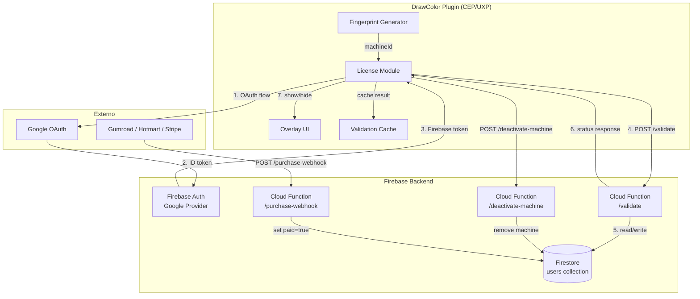
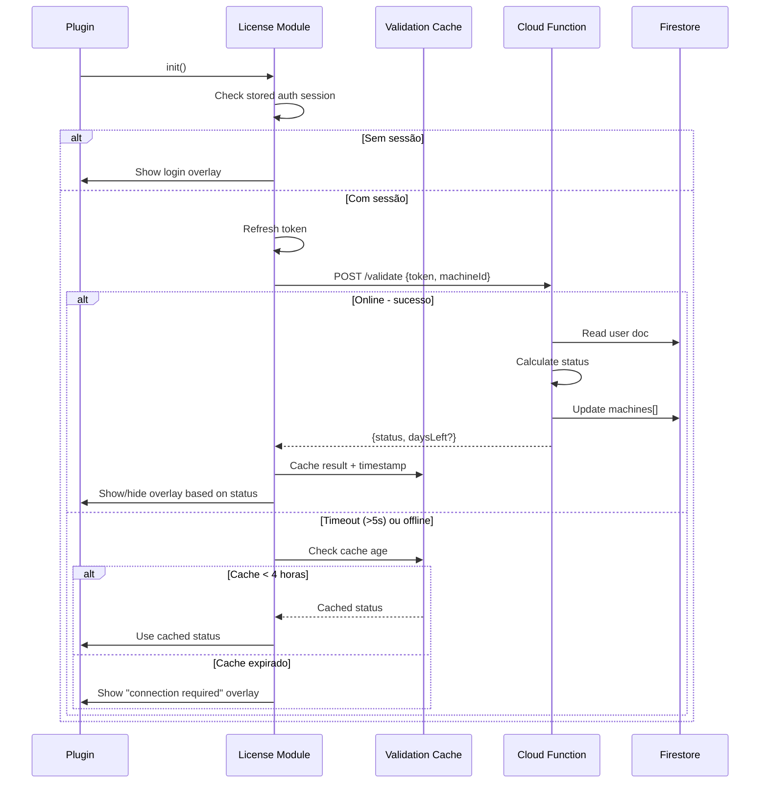

# Design Document: Firebase Licensing

## Overview

O sistema de licenciamento do DrawColor usa Firebase como backend completo: Authentication para identidade via Google OAuth, Cloud Functions para lógica de validação server-side, e Firestore como armazenamento de estado da licença. O plugin (CEP/UXP) se comunica com as Cloud Functions via HTTPS, nunca acessando o Firestore diretamente.

A arquitetura segue o padrão "thin client, fat server": o plugin é responsável apenas por autenticação, envio de requisições de validação, cache local, e exibição do overlay de bloqueio. Toda a lógica de negócio (cálculo de trial, controle de máquinas, ativação via webhook) reside nas Cloud Functions.

### Decisões-chave

| Decisão | Justificativa |
|---------|---------------|
| OAuth via browser externo | CEP/UXP são ambientes embarcados que não suportam popups OAuth nativos. Google deprecou OAuth em browsers não-padrão (ex: Electron). O fluxo usa localhost redirect para capturar o token. |
| HTTPS functions (não callable) | O plugin não usa o Firebase Client SDK completo — apenas REST calls. Isso mantém o bundle leve e compatível com CEP. |
| Machine fingerprint = hostname + username | Determinístico, estável entre sessões, disponível em ambos os ambientes (CEP via Node.js `os`, UXP via system APIs). |
| Grace period de 4h | Equilibra proteção contra pirataria com UX realista para artistas em aviões/cafés sem Wi-Fi estável. |
| Limite de 2 máquinas | Padrão da indústria para licenças individuais de plugins criativos (desktop + laptop). |

## Architecture



### Fluxo de Inicialização



## Components and Interfaces

### 1. License Module (`license.js`)

Módulo principal no plugin. Responsável por toda a comunicação com Firebase e gestão do estado de licenciamento.

```typescript
interface LicenseModule {
  // Initialization
  init(): Promise<void>;
  
  // Authentication
  login(): Promise<AuthResult>;
  logout(): void;
  getToken(): string | null;
  isAuthenticated(): boolean;
  
  // Validation
  validate(): Promise<ValidationResult>;
  getCachedStatus(): CachedValidation | null;
  
  // Machine management
  getMachineId(): string;
  deactivateMachine(machineId: string): Promise<DeactivateResult>;
  
  // State
  getStatus(): LicenseStatus;
  getDaysLeft(): number | null;
  onStatusChange(callback: (status: LicenseStatus) => void): void;
}

type LicenseStatus = 'trial' | 'active' | 'expired' | 'machine_limit' | 'unauthenticated' | 'offline_grace' | 'offline_expired';

interface ValidationResult {
  status: 'trial' | 'active' | 'expired' | 'machine_limit';
  daysLeft?: number;
  machines?: MachineInfo[];
}

interface CachedValidation {
  status: LicenseStatus;
  timestamp: number;
  daysLeft?: number;
}

interface MachineInfo {
  id: string;
  name: string;
  lastSeen: string; // ISO timestamp
}

interface AuthResult {
  success: boolean;
  error?: string;
  email?: string;
}

interface DeactivateResult {
  success: boolean;
  error?: string;
}
```

### 2. Fingerprint Generator

Gera identificador determinístico por máquina.

```typescript
interface FingerprintGenerator {
  generate(): string;
  getDisplayName(): string;
}
```

**Implementação por plataforma:**
- **CEP**: `cep_node.require('os').hostname() + '|' + cep_node.require('os').userInfo().username`
- **UXP**: `require('os').hostname() + '|' + require('os').userInfo().username`
- **Web (demo)**: `'web-demo|anonymous'` (sempre retorna status fixo para demo)

### 3. Overlay Controller

Gerencia a UI de bloqueio sobre o plugin.

```typescript
interface OverlayController {
  show(state: OverlayState): void;
  hide(): void;
  isVisible(): boolean;
}

type OverlayState = 
  | { type: 'login' }
  | { type: 'expired' }
  | { type: 'machine_limit'; machines: MachineInfo[] }
  | { type: 'offline_expired' }
  | { type: 'error'; message: string };
```

### 4. Cloud Functions API

```typescript
// POST /validate
interface ValidateRequest {
  token: string;       // Firebase ID token
  machineId: string;   // Machine fingerprint
}

interface ValidateResponse {
  status: 'trial' | 'active' | 'expired' | 'machine_limit';
  daysLeft?: number;        // Present when status is 'trial'
  machines?: MachineInfo[]; // Present when status is 'machine_limit'
}

// POST /deactivate-machine
interface DeactivateRequest {
  token: string;
  machineId: string; // Machine to remove
}

interface DeactivateResponse {
  success: boolean;
  message: string;
}

// POST /purchase-webhook
interface WebhookPayload {
  email: string;
  signature: string;       // HMAC or platform-specific verification
  platform: 'gumroad' | 'hotmart' | 'stripe';
  transactionId?: string;
}
```

### 5. OAuth Flow Handler

Para CEP e UXP, o OAuth usa um servidor HTTP local temporário para capturar o redirect.

```typescript
interface OAuthFlowHandler {
  // Starts OAuth flow: opens browser, waits for callback
  startFlow(): Promise<OAuthToken>;
  // Cancels an in-progress flow
  cancelFlow(): void;
}

interface OAuthToken {
  idToken: string;
  accessToken: string;
}
```

**Fluxo detalhado (CEP):**
1. Inicia servidor HTTP em `localhost:{port_aleatório}`
2. Abre URL do Google OAuth no browser externo com `redirect_uri=http://localhost:{port}/callback`
3. Usuário consente no browser
4. Google redireciona para `localhost:{port}/callback?code=...`
5. Servidor captura o authorization code
6. Troca code por tokens usando Google Token endpoint
7. Usa `signInWithCredential` do Firebase com o ID token Google
8. Fecha o servidor local

## Data Models

### Firestore Document: `users/{uid}`

```typescript
interface UserDocument {
  email: string;                    // Email Google do usuário
  trialStart: Timestamp;           // Quando o trial começou
  paid: boolean;                    // Se pagou (ativado via webhook)
  machines: MachineEntry[];         // Máquinas registradas (max 2)
  createdAt: Timestamp;            // Quando o documento foi criado
}

interface MachineEntry {
  id: string;                       // Machine fingerprint (hostname|username)
  name: string;                     // Nome legível (hostname)
  lastSeen: Timestamp;             // Última validação bem-sucedida
}
```

### Validation Cache (Local Storage)

```typescript
interface ValidationCacheEntry {
  status: 'trial' | 'active';
  validatedAt: number;              // Date.now() da última validação
  daysLeft?: number;                // Dias restantes do trial
  machineId: string;                // Fingerprint que validou
}
```

Armazenado como JSON em:
- **CEP/Web**: `localStorage` key `drawcolor-license-cache`
- **UXP**: Arquivo via Platform Adapter (mesmo padrão de `drawcolor-state.json`)

### Auth Session (Local Storage)

```typescript
interface AuthSession {
  uid: string;
  email: string;
  refreshToken: string;
  lastTokenRefresh: number;
}
```

Armazenado em key `drawcolor-auth-session`.


## Correctness Properties

*A property is a characteristic or behavior that should hold true across all valid executions of a system — essentially, a formal statement about what the system should do. Properties serve as the bridge between human-readable specifications and machine-verifiable correctness guarantees.*

### Property 1: User Document Structure Invariant

*For any* user document created or updated by the Cloud Functions, the document SHALL contain all required fields (email as string, trialStart as timestamp, paid as boolean, machines as array, createdAt as timestamp), and each machine entry in the machines array SHALL contain id (string), name (string), and lastSeen (timestamp).

**Validates: Requirements 2.1, 11.1, 11.3**

### Property 2: Registration Idempotence

*For any* existing user document in Firestore, calling the registration/first-login flow a second time with the same user identity SHALL leave all existing fields (paid, trialStart, machines, createdAt) unchanged.

**Validates: Requirements 2.2**

### Property 3: Trial Status Calculation

*For any* user document with paid=false, the validation function SHALL return status `trial` if and only if the current timestamp is less than trialStart + 14 days, and SHALL return status `expired` if and only if the current timestamp is greater than or equal to trialStart + 14 days. The calculation SHALL use exclusively the trialStart value from Firestore, ignoring any client-provided trial data.

**Validates: Requirements 3.1, 3.2, 3.3**

### Property 4: Paid User Status Determination

*For any* user document with paid=true, the validation function SHALL return: status `active` if the requesting machine is already in the machines list OR the machines list has fewer than 2 entries; status `machine_limit` if the machines list already contains 2 entries and the requesting machine is not among them. When status is `active` and the machine was already present, the machine's lastSeen field SHALL be updated.

**Validates: Requirements 4.2, 4.3, 4.4**

### Property 5: Machine Registration on Successful Validation

*For any* validation that results in status `trial` or `active`, the requesting machine SHALL appear in the user's machines array with its id matching the provided machineId, name containing the hostname, and lastSeen set to the current timestamp.

**Validates: Requirements 4.5**

### Property 6: Machine Count Invariant

*For any* sequence of validation requests to the Cloud Function, the machines array in a user's document SHALL never contain more than 2 entries.

**Validates: Requirements 5.1**

### Property 7: Machine Deactivation Removes Entry

*For any* user with machines in their list, calling deactivate-machine with a machineId that exists in the list SHALL result in the machines array having exactly one fewer entry, and the specified machineId SHALL no longer appear in the list.

**Validates: Requirements 5.4**

### Property 8: Fingerprint Determinism

*For any* pair of (hostname, username) strings, the fingerprint generator SHALL always produce the same output string equal to `hostname + '|' + username`, regardless of how many times it is called or when it is called.

**Validates: Requirements 6.3, 6.4**

### Property 9: Cache Validity Threshold

*For any* successful validation response, the License Module SHALL store status and timestamp in cache. Subsequently, *for any* offline scenario, the module SHALL use the cached status if the cache age is less than 4 hours (grace period), and SHALL show the offline-expired overlay if the cache age is 4 hours or more.

**Validates: Requirements 7.1, 7.2, 7.3**

### Property 10: Overlay Reflects License Status

*For any* license status of `trial` or `active`, the overlay SHALL be hidden and the plugin interface SHALL be fully interactive. *For any* status of `expired`, `machine_limit`, or `unauthenticated`, the overlay SHALL be visible and block interaction.

**Validates: Requirements 8.6, 8.4**

### Property 11: Webhook Activation

*For any* valid webhook payload with a verified signature, the Cloud Function SHALL ensure the user document for the given email has paid=true. If no user document exists for that email, a new document SHALL be created with paid=true and trialStart set to the current timestamp.

**Validates: Requirements 9.1, 9.2**

### Property 12: Webhook Signature Enforcement

*For any* webhook request with an invalid or missing signature, the Cloud Function SHALL return HTTP 403 AND SHALL not modify any document in Firestore.

**Validates: Requirements 9.3, 9.4**

## Error Handling

### Client-Side (License Module)

| Cenário | Comportamento | UX |
|---------|--------------|-----|
| Rede indisponível no login | Catch no OAuth flow, exibe erro no overlay | "Sem conexão. Verifique sua internet e tente novamente." |
| Token expirado durante uso | Auto-refresh via refreshToken. Se falhar, redireciona para login | Transparente se refresh funciona; login overlay se não |
| Timeout na validação (>5s) | Fallback para cache se dentro do grace period | Continua trabalhando; badge discreto "offline" |
| Cache expirado + sem rede | Overlay de revalidação | "Conecte à internet para revalidar sua licença." |
| Resposta inesperada do server | Log do erro, trata como falha de rede | Fallback para cache ou overlay |
| Machine deactivation falha | Exibe erro inline na lista de máquinas | "Não foi possível desativar. Tente novamente." |

### Server-Side (Cloud Functions)

| Cenário | HTTP Code | Resposta |
|---------|-----------|----------|
| Token inválido/expirado | 401 | `{ error: "Invalid or expired token" }` |
| MachineId ausente | 400 | `{ error: "machineId is required" }` |
| Usuário não encontrado (validate) | 401 | `{ error: "User not found" }` |
| MachineId não encontrado (deactivate) | 404 | `{ error: "Machine not found" }` |
| Webhook assinatura inválida | 403 | `{ error: "Invalid signature" }` |
| Erro interno do Firestore | 500 | `{ error: "Internal server error" }` |
| Rate limit excedido | 429 | `{ error: "Too many requests" }` |

### Estratégia de Retry

- **Validação**: Sem retry automático. O cache cobre falhas transitórias.
- **Login OAuth**: Usuário clica novamente no botão (retry manual).
- **Deactivation**: Retry manual pelo usuário no overlay.
- **Webhook**: A plataforma de pagamento faz retry automático (Gumroad: 3x, Stripe: exponential backoff por 72h).

## Testing Strategy

### Abordagem Dual: Unit Tests + Property Tests

O sistema de licenciamento é majoritariamente lógica pura de decisão (cálculo de trial, determinação de status, controle de máquinas), o que o torna ideal para property-based testing.

### Property-Based Tests (fast-check)

**Biblioteca**: `fast-check` (já presente no projeto)
**Configuração**: Mínimo 100 iterações por propriedade
**Tag format**: `Feature: firebase-licensing, Property {N}: {title}`

Propriedades a implementar:
1. **User Document Structure** — Gerar dados aleatórios de usuário, verificar schema do documento
2. **Registration Idempotence** — Gerar documentos existentes variados, verificar imutabilidade
3. **Trial Status Calculation** — Gerar timestamps aleatórios (antes/depois de 14d), verificar status correto
4. **Paid User Status** — Gerar estados de máquina variados (0-3 máquinas, presente/ausente), verificar status
5. **Machine Registration** — Gerar validações com máquinas aleatórias, verificar campo machines
6. **Machine Count Invariant** — Gerar sequências de validações, verificar machines.length <= 2
7. **Machine Deactivation** — Gerar listas de máquinas, desativar uma, verificar remoção
8. **Fingerprint Determinism** — Gerar pares (hostname, username) aleatórios, verificar consistência
9. **Cache Validity Threshold** — Gerar timestamps e estados offline, verificar decisão correta
10. **Overlay Status Mapping** — Gerar todos os status possíveis, verificar visibilidade do overlay
11. **Webhook Activation** — Gerar payloads com emails existentes/novos, verificar paid=true
12. **Webhook Signature Enforcement** — Gerar payloads com assinaturas inválidas, verificar rejeição

### Unit Tests (Example-Based)

- Login flow: mock OAuth + Firebase Auth, verify token storage
- Overlay states: verify correct content for each status
- Platform-specific fingerprint: mock os module per environment
- Initialization sequence: verify order (session check → validate → cache fallback)
- Timeout fallback: mock 5s timeout, verify cache is used

### Integration Tests

- OAuth flow handler: verify local server starts and captures redirect
- Firebase Auth wiring: verify signInWithCredential is called correctly
- Cloud Function deployment: verify endpoints respond to valid requests
- Firestore security rules: verify client access is denied

### Smoke Tests

- Firestore rules deny direct read/write
- Cloud Functions are deployed and reachable
- Plugin startup time < 1 second after validation response
- Overlay cannot be removed via simple DOM manipulation

### Test Organization

```
tests/
  license-properties.test.js    # Property-based tests (fast-check)
  license-validate.test.js      # Unit tests for validation logic
  license-cache.test.js         # Unit tests for cache/offline logic
  license-fingerprint.test.js   # Unit tests for fingerprint generation
  license-overlay.test.js       # Unit tests for overlay state mapping
  license-webhook.test.js       # Unit tests for webhook processing
```

Cada test file de propriedade deve referenciar o design document:
```javascript
// Feature: firebase-licensing, Property 3: Trial Status Calculation
test('trial status is determined by trialStart + 14 days threshold', () => {
  fc.assert(fc.property(
    fc.date({ min: new Date('2024-01-01'), max: new Date('2026-12-31') }),
    (trialStart) => {
      // ... property implementation
    }
  ), { numRuns: 100 });
});
```
