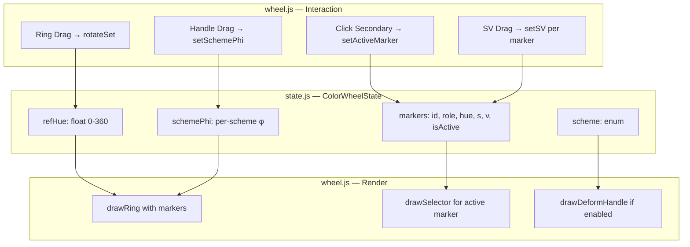
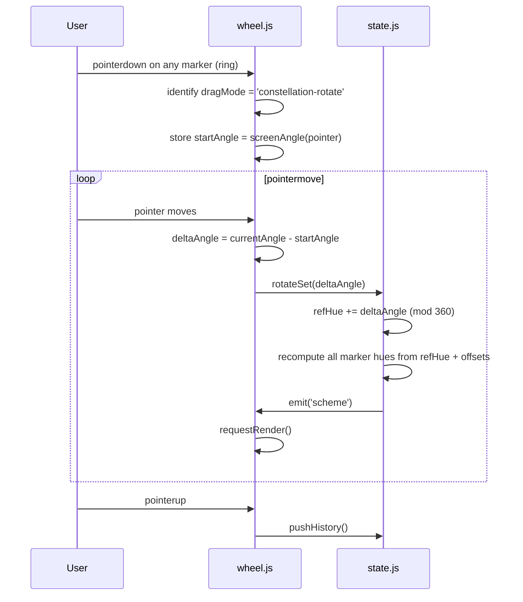
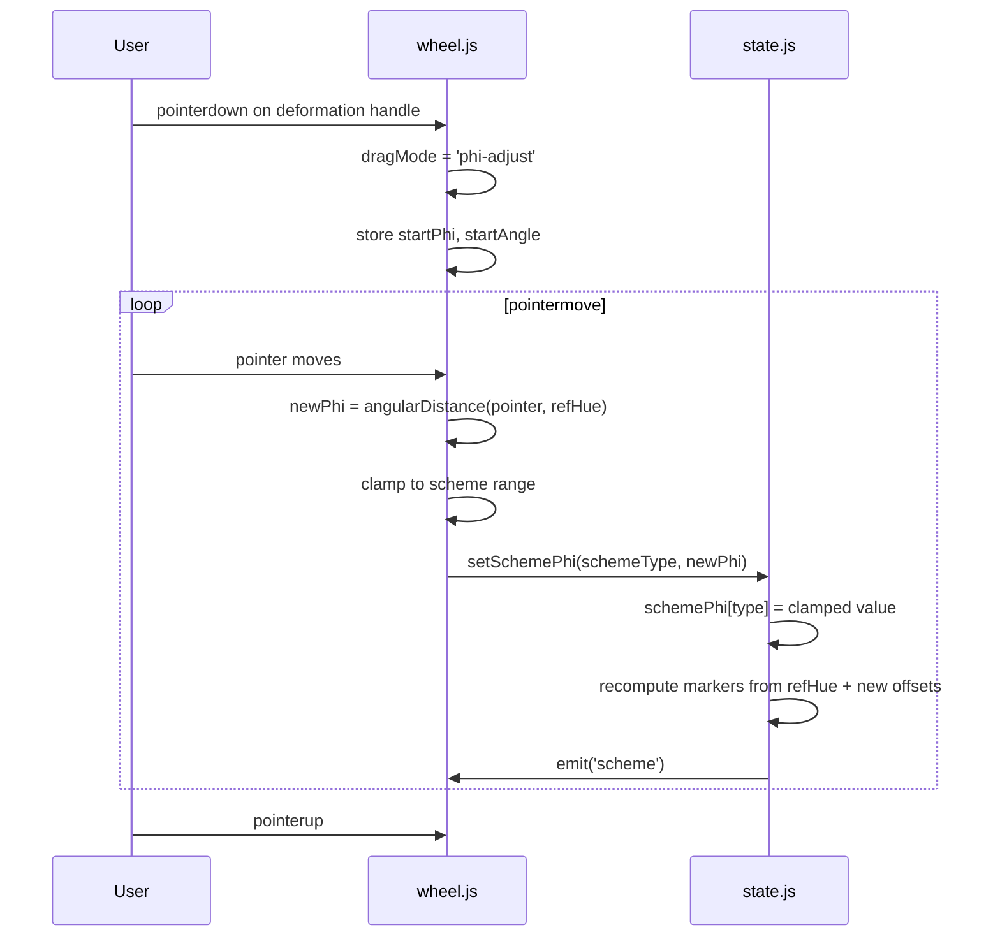
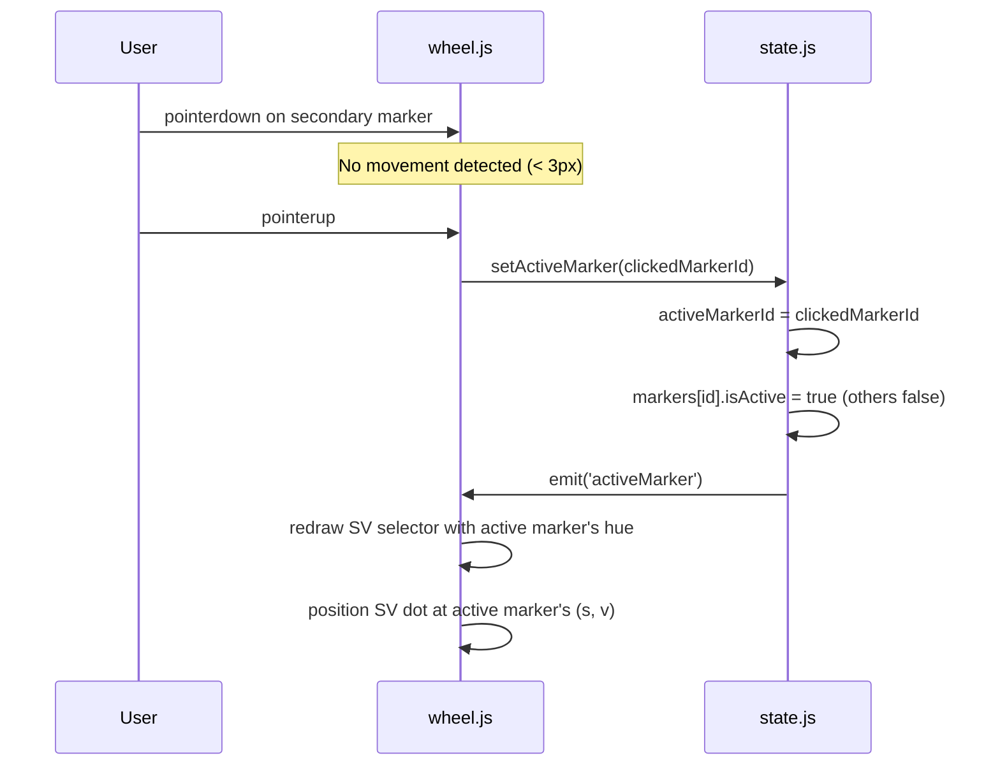

# Design Document: Harmony Coolorus-Style

## Overview

Refactor the DrawColor harmony system to match Coolorus behavior: dragging any marker (master or secondary) rotates the entire constellation as a rigid body, fixed-geometry schemes (Complementary, Triadic) have no deformation handle, adjustable-φ schemes (Analogous, Analogous Accented, Tetradic) expose a deformation handle for the spread angle, clicking a secondary marker performs a "quick swap" to display that hue's S/V in the triangle without altering the scheme geometry, and each marker independently stores its own saturation/value.

The refactoring replaces the current `harmonyOffsets` model in `state.js` with a `schemePhi` model that separates reference-hue rotation from per-scheme spread angles, rewrites the pointer handlers in `wheel.js` for rigid-body rotation and handle-based deformation, and introduces per-marker S/V storage so the artist can paint from any secondary without losing its color.

## Architecture



## Sequence Diagrams

### Rigid-Body Rotation (Drag Any Marker)



### Deformation Handle Drag (Adjustable-φ Schemes)



### Quick Swap (Click Secondary Without Drag)



## Components and Interfaces

### Component 1: ColorWheelState (state.js)

**Purpose**: Central state management for the harmony system. Replaces the current `harmonyOffsets` model with the Coolorus-style `schemePhi` + `refHue` model.

**Interface**:

```javascript
// New state shape
const ColorWheelState = {
  scheme: 'none', // 'none' | 'comp' | 'analog' | 'accent' | 'triad' | 'tetra'
  refHue: 0,      // float 0-360, the reference angle for the constellation

  schemePhi: {
    tetra: 30,     // range 10-80
    analog: 15,    // range 10-60
    accent: 15     // range 10-60
  },

  markers: [
    // { id: 'master', role: 'master', hue: 0, s: 100, v: 100, isActive: true }
    // { id: 'sec-1', role: 'secondary', hue: 180, s: 80, v: 60, isActive: false }
  ],

  activeMarkerId: 'master'
};
```

**New Public API**:

```javascript
// Rotates entire constellation by delta degrees (rigid body)
function rotateSet(deltaAngle)

// Changes the active scheme; recomputes markers from refHue + scheme offsets
function setScheme(type)

// Quick swap: makes a secondary marker active (triangle shows its SV)
function setActiveMarker(markerId)

// Updates S/V for one specific marker only
function setSV(markerId, s, v)

// Adjusts the deformation angle φ for adjustable schemes
function setSchemePhi(schemeType, phi)

// Returns computed marker positions (hue derived from refHue + scheme offsets)
function getMarkers()

// Returns whether the current scheme has a deformation handle
function hasDeformHandle()

// Returns the φ range [min, max] for the current scheme
function getPhiRange()
```

**Responsibilities**:
- Store and validate refHue, schemePhi, markers, activeMarkerId
- Compute marker hues from `refHue + schemeOffsets(phi)`
- Enforce φ ranges (analogous: 10-60°, tetradic: 10-80°)
- Preserve independent S/V per marker across rotations and scheme changes
- Maintain backward compatibility with gamut masking, luminosity lock, and temperature

### Component 2: Wheel Interaction (wheel.js)

**Purpose**: Handle pointer events to distinguish between rigid-body rotation, deformation handle dragging, quick swap, and SV manipulation.

**Interface**:

```javascript
// Internal drag modes (extends current set)
// 'constellation-rotate' — drag any ring marker → rotateSet
// 'phi-adjust'           — drag deformation handle → setSchemePhi
// 'sv'                   — drag inside selector → setSV for active marker
// 'ring'                 — REMOVED for harmony markers (only used for mono)

// Hit testing
function pickMarker(point)       // returns { type: 'master'|'secondary', id, index }
function pickDeformHandle(point) // returns handle info or null
```

**Responsibilities**:
- Detect which marker or handle the pointer hit
- Distinguish click (no drag, < 3px) from drag for quick swap vs rotate
- Route drag events to `rotateSet` or `setSchemePhi` based on what was grabbed
- Render deformation handles only for schemes where `shapeHandleEnabled` is true
- Draw leader lines from deformation handle to the φ markers

## Data Models

### ColorWheelState (Full Schema)

```javascript
/**
 * @typedef {Object} Marker
 * @property {string} id - Unique identifier (e.g., 'master', 'sec-0', 'sec-1')
 * @property {'master'|'secondary'} role
 * @property {number} hue - Computed: refHue + offset (read-only from outside)
 * @property {number} s - Saturation 0-100, independent per marker
 * @property {number} v - Value 0-100, independent per marker
 * @property {boolean} isActive - Only one marker is active at a time
 */

/**
 * @typedef {Object} SchemePhi
 * @property {number} tetra - φ for tetradic, default 30, range [10, 80]
 * @property {number} analog - φ for analogous, default 15, range [10, 60]
 * @property {number} accent - φ for analogous accented, default 15, range [10, 60]
 */

/**
 * @typedef {Object} SchemeConfig
 * @property {string} id - 'none'|'comp'|'analog'|'accent'|'triad'|'tetra'
 * @property {string} label - Display name
 * @property {function(number): number[]} offsets - Given φ, returns offset array
 * @property {boolean} handleEnabled - Whether deformation handle shows
 * @property {[number,number]|null} phiRange - [min, max] or null if fixed
 */
```

**Validation Rules**:
- `refHue` is always normalized to [0, 360)
- `schemePhi.tetra` clamped to [10, 80]
- `schemePhi.analog` and `schemePhi.accent` clamped to [10, 60]
- `markers` array length matches scheme: mono=1, comp=2, analog=3, accent=4, triad=3, tetra=4
- Exactly one marker has `isActive === true` at all times
- `s` and `v` per marker are clamped to [0, 100]

### Scheme Definitions (Angular Geometry)

```javascript
const SCHEME_DEFS = {
  none: {
    id: 'none', label: 'Mono',
    offsets: () => [0],
    handleEnabled: false,
    phiRange: null
  },
  comp: {
    id: 'comp', label: 'Complementar',
    offsets: () => [0, 180],
    handleEnabled: false,
    phiRange: null
  },
  triad: {
    id: 'triad', label: 'Triádico',
    offsets: () => [0, 120, 240],
    handleEnabled: false,
    phiRange: null
  },
  tetra: {
    id: 'tetra', label: 'Tetrádico',
    offsets: (phi) => [0, phi, 180, 180 + phi],
    handleEnabled: true,
    phiRange: [10, 80]
  },
  analog: {
    id: 'analog', label: 'Análogo',
    offsets: (phi) => [-phi, 0, phi],
    handleEnabled: true,
    phiRange: [10, 60]
  },
  accent: {
    id: 'accent', label: 'Análogo acentuado',
    offsets: (phi) => [-phi, 0, phi, 180],
    handleEnabled: true,
    phiRange: [10, 60]
  }
};
```

## Key Functions with Formal Specifications

### Function 1: rotateSet(deltaAngle)

```javascript
function rotateSet(deltaAngle) {
  state.refHue = ((state.refHue + deltaAngle) % 360 + 360) % 360;
  recomputeMarkerHues();
  emit('scheme');
}
```

**Preconditions:**
- `deltaAngle` is a finite number
- `state.scheme` is a valid scheme id
- `state.markers` array is properly initialized

**Postconditions:**
- `refHue` is in [0, 360)
- All marker hues shift by exactly `deltaAngle`
- Marker S/V values are unchanged
- Relative angles between markers are unchanged (rigid body invariant)
- `activeMarkerId` is unchanged

**Loop Invariants:** N/A

---

### Function 2: setSchemePhi(schemeType, phi)

```javascript
function setSchemePhi(schemeType, phi) {
  const range = SCHEME_DEFS[schemeType].phiRange;
  if (!range) return; // fixed-geometry scheme, ignore
  const clamped = Math.max(range[0], Math.min(range[1], phi));
  state.schemePhi[schemeType] = clamped;
  recomputeMarkerHues();
  emit('scheme');
}
```

**Preconditions:**
- `schemeType` is one of: 'tetra', 'analog', 'accent'
- `phi` is a finite number
- The scheme must have `handleEnabled === true`

**Postconditions:**
- `schemePhi[schemeType]` is within the scheme's `phiRange`
- Marker hues are recomputed using the new φ
- `refHue` is unchanged
- Marker S/V values are unchanged

**Loop Invariants:** N/A

---

### Function 3: setActiveMarker(markerId)

```javascript
function setActiveMarker(markerId) {
  const marker = state.markers.find(m => m.id === markerId);
  if (!marker) return;
  state.markers.forEach(m => { m.isActive = (m.id === markerId); });
  state.activeMarkerId = markerId;
  emit('activeMarker');
}
```

**Preconditions:**
- `markerId` corresponds to an existing marker in `state.markers`

**Postconditions:**
- Exactly one marker has `isActive === true`
- `activeMarkerId === markerId`
- No marker hues change (scheme geometry preserved)
- No S/V values change
- The SV selector displays the active marker's hue

**Loop Invariants:** N/A

---

### Function 4: setSV(markerId, s, v)

```javascript
function setSV(markerId, s, v) {
  const marker = state.markers.find(m => m.id === markerId);
  if (!marker) return;
  marker.s = clamp(s, 0, 100);
  marker.v = clamp(v, 0, 100);
  emit('color');
}
```

**Preconditions:**
- `markerId` exists in `state.markers`
- `s` and `v` are finite numbers

**Postconditions:**
- Only the specified marker's S/V changes
- All other markers' S/V are unchanged
- All marker hues are unchanged
- The scheme geometry (φ, refHue) is unchanged

**Loop Invariants:** N/A

---

### Function 5: setScheme(type)

```javascript
function setScheme(type) {
  if (!SCHEME_DEFS[type]) return;
  state.scheme = type;
  rebuildMarkers();
  emit('scheme');
}
```

**Preconditions:**
- `type` is a valid key in `SCHEME_DEFS`

**Postconditions:**
- `state.scheme === type`
- `state.markers` has the correct count for the new scheme
- Marker hues are computed from `refHue` + scheme offsets using current φ
- The master marker preserves its S/V from before
- New secondary markers get default S/V (100, 100)
- `activeMarkerId` resets to 'master' if the previously active marker no longer exists

**Loop Invariants:** N/A

---

### Function 6: recomputeMarkerHues()

```javascript
function recomputeMarkerHues() {
  const def = SCHEME_DEFS[state.scheme];
  const phi = state.schemePhi[state.scheme] || 0;
  const offsets = def.offsets(phi);

  state.markers.forEach((marker, i) => {
    marker.hue = ((state.refHue + offsets[i]) % 360 + 360) % 360;
  });
}
```

**Preconditions:**
- `state.markers.length === SCHEME_DEFS[state.scheme].offsets(phi).length`
- `state.refHue` is in [0, 360)

**Postconditions:**
- Each marker's hue equals `(refHue + offset_i) mod 360`
- Marker S/V values are untouched
- The relative angular distances match the scheme definition exactly

**Loop Invariants:**
- For all i: `marker[i].hue === (refHue + offsets[i]) % 360`

## Algorithmic Pseudocode

### Pointer Down Routing

```javascript
ALGORITHM onPointerDown(event)
INPUT: pointer event with coordinates
OUTPUT: sets dragMode and rotateAnchor

BEGIN
  p ← toCanvasCoords(event)
  dist ← distance(p, center)
  onRing ← (dist >= INNER_R - 2) AND (dist <= OUTER_R + 2)

  IF onRing THEN
    // Check deformation handle first (smallest target)
    handle ← pickDeformHandle(p)
    IF handle ≠ null AND hasDeformHandle() THEN
      dragMode ← 'phi-adjust'
      rotateAnchor ← { startAngle: screenAngle(p), startPhi: currentPhi() }
      RETURN
    END IF

    // Check any marker (master or secondary)
    marker ← pickMarker(p)
    IF marker ≠ null THEN
      dragMode ← 'constellation-rotate'
      rotateAnchor ← { startAngle: screenAngle(p), startRefHue: state.refHue, 
                        markerId: marker.id, startPos: p, moved: false }
      RETURN
    END IF

    // Click on ring but not on a marker: set hue directly (mono behavior)
    IF state.scheme === 'none' THEN
      dragMode ← 'ring'
      applyRing(p)
    ELSE
      // In harmony mode, ring click also rotates the constellation
      dragMode ← 'constellation-rotate'
      rotateAnchor ← { startAngle: screenAngle(p), startRefHue: state.refHue,
                        markerId: null, startPos: p, moved: false }
    END IF
  ELSE IF dist < INNER_R THEN
    dragMode ← 'sv'
    applySvForActiveMarker(p)
  END IF
END
```

### Pointer Move Routing

```javascript
ALGORITHM onPointerMove(event)
INPUT: pointer event during active drag
OUTPUT: updates state based on dragMode

BEGIN
  p ← toCanvasCoords(event)

  SWITCH dragMode
    CASE 'constellation-rotate':
      delta ← screenAngle(p) - rotateAnchor.startAngle
      IF event.shiftKey THEN delta ← round(delta / 15) × 15
      rotateSet(delta - (state.refHue - rotateAnchor.startRefHue))
      rotateAnchor.moved ← true

    CASE 'phi-adjust':
      // φ = angular distance from pointer to refHue direction
      pointerAngle ← screenAngle(p) - state.wheelRotation
      phi ← abs(pointerAngle - state.refHue)
      IF phi > 180 THEN phi ← 360 - phi
      setSchemePhi(state.scheme, phi)

    CASE 'sv':
      applySvForActiveMarker(p)

    CASE 'ring':
      applyRing(p)  // mono mode only
  END SWITCH
END
```

### Pointer Up Routing

```javascript
ALGORITHM onPointerUp(event)
INPUT: pointer event at end of gesture
OUTPUT: finalizes action (quick swap or commit)

BEGIN
  IF dragMode = 'constellation-rotate' AND NOT rotateAnchor.moved THEN
    // No movement detected: this is a quick swap click
    IF rotateAnchor.markerId ≠ null AND rotateAnchor.markerId ≠ 'master' THEN
      setActiveMarker(rotateAnchor.markerId)
    END IF
  END IF

  IF dragMode = 'constellation-rotate' OR dragMode = 'ring' THEN
    pushHistory()
  END IF

  dragMode ← null
  rotateAnchor ← null
END
```

### Rebuild Markers on Scheme Change

```javascript
ALGORITHM rebuildMarkers(preserveActive)
INPUT: current state (scheme, refHue, schemePhi)
OUTPUT: new markers array

BEGIN
  def ← SCHEME_DEFS[state.scheme]
  phi ← state.schemePhi[state.scheme] OR 0
  offsets ← def.offsets(phi)
  
  oldMarkers ← state.markers (copy)
  newMarkers ← []

  FOR i ← 0 TO offsets.length - 1 DO
    hue ← (state.refHue + offsets[i]) mod 360
    role ← (i = 0) ? 'master' : 'secondary'
    id ← (i = 0) ? 'master' : 'sec-' + (i - 1)

    // Preserve S/V from matching old marker if it exists
    old ← oldMarkers.find(m → m.id = id)
    s ← old ? old.s : 100
    v ← old ? old.v : 100

    newMarkers.push({ id, role, hue, s, v, isActive: false })
  END FOR

  // Set active marker
  IF newMarkers.find(m → m.id = state.activeMarkerId) THEN
    newMarkers.find(m → m.id = state.activeMarkerId).isActive ← true
  ELSE
    newMarkers[0].isActive ← true
    state.activeMarkerId ← newMarkers[0].id
  END IF

  state.markers ← newMarkers
END
```

## Example Usage

```javascript
// === Rigid-body rotation ===
// User drags the complementary secondary marker 45° clockwise
state.scheme = 'comp';
state.refHue = 90;
// Markers: master at 90°, secondary at 270°
rotateSet(45);
// Now: master at 135°, secondary at 315° — offset preserved at 180°

// === Deformation handle ===
// User adjusts analogous spread from 15° to 40°
state.scheme = 'analog';
state.refHue = 200;
setSchemePhi('analog', 40);
// Markers: [-40°, 0°, +40°] relative → hues at 160°, 200°, 240°

// === Quick swap ===
// User clicks the +φ secondary of analogous without dragging
setActiveMarker('sec-1');
// Triangle now shows hue 240° with sec-1's own S/V
// Scheme geometry unchanged, all hues stay the same

// === Independent S/V ===
// User picks a dark desaturated green for secondary marker
setSV('sec-0', 35, 42);
// Only sec-0 changes; master and sec-1 keep their S/V
// When quick-swapping to sec-0, triangle shows s=35, v=42

// === Tetradic with custom φ ===
state.scheme = 'tetra';
state.refHue = 0;
setSchemePhi('tetra', 60);
// Markers at: 0°, 60°, 180°, 240°
```

## Correctness Properties

### Property 1: Rigid Body Invariant

For any rotation Δ, for all pairs of markers (i, j): `angleDist(marker[i].hue, marker[j].hue)` before rotation equals `angleDist(marker[i].hue, marker[j].hue)` after rotation. Dragging any marker rotates the entire constellation without deforming it.

### Property 2: φ Independence from refHue

Changing `refHue` via `rotateSet` never modifies `schemePhi`. Changing `schemePhi` via `setSchemePhi` never modifies `refHue`. The two state dimensions are orthogonal.

### Property 3: S/V Isolation

`rotateSet(Δ)` for any Δ preserves `marker.s` and `marker.v` for all markers. `setSchemePhi(type, phi)` preserves all markers' S/V. `setActiveMarker(id)` preserves all markers' S/V. Only `setSV(id, s, v)` modifies a marker's saturation/value, and only for the specified marker.

### Property 4: Quick Swap Geometry Preservation

`setActiveMarker(id)` does not alter any marker's hue, nor `refHue`, nor `schemePhi`. It only changes which marker is displayed in the SV selector.

### Property 5: φ Clamping

For analogous and accent, φ is always in [10, 60]. For tetradic, φ is always in [10, 80]. No operation can produce a φ outside these ranges.

### Property 6: Marker Count Consistency

The number of markers always equals the number of offsets returned by `SCHEME_DEFS[scheme].offsets(phi)`. Mono=1, Complementary=2, Triadic=3, Analogous=3, Analogous Accented=4, Tetradic=4.

### Property 7: Single Active Invariant

At all times, exactly one marker in `state.markers` has `isActive === true`. The `activeMarkerId` field always references a valid marker id.

### Property 8: Hue Derivation

For all markers at index i: `marker[i].hue === (refHue + offsets(phi)[i]) mod 360`. Hues are never stored independently; they are always derived from refHue and the scheme's offset function.

### Property 9: Handle Visibility

`hasDeformHandle()` returns true if and only if `SCHEME_DEFS[scheme].handleEnabled === true`. Complementary and Triadic never show handles. Analogous, Accent, and Tetradic always show handles.

### Property 10: Backward Compatibility

Gamut mask (`insideMask`, `clampToMask`) continues to operate on the active marker's hue and saturation. Luminosity lock operates on the active marker's value. Temperature offset applies to refHue uniformly.

## Error Handling

### Error Scenario 1: Invalid Scheme ID

**Condition**: `setScheme(type)` called with a type not in `SCHEME_DEFS`
**Response**: Silently return without modifying state (matches current behavior)
**Recovery**: No recovery needed; state remains consistent

### Error Scenario 2: setSchemePhi on Fixed Scheme

**Condition**: `setSchemePhi('comp', 30)` — attempting to set φ on a scheme without a handle
**Response**: Silently return; φ storage only exists for adjustable schemes
**Recovery**: The `phiRange === null` guard prevents any modification

### Error Scenario 3: setActiveMarker with Unknown ID

**Condition**: `setActiveMarker('nonexistent')`
**Response**: Return without modifying state; the active marker stays as-is
**Recovery**: No corruption possible; the find returns undefined and the early return fires

### Error Scenario 4: Marker Overflow on Scheme Switch

**Condition**: Switching from tetradic (4 markers) to mono (1 marker) while sec-2 was active
**Response**: `rebuildMarkers` detects missing active marker, resets to 'master'
**Recovery**: Active marker always valid after scheme change

### Error Scenario 5: NaN/Infinity in rotateSet

**Condition**: `rotateSet(NaN)` or `rotateSet(Infinity)`
**Response**: Guard with `isFinite()` check; return without modifying state
**Recovery**: State unchanged, render not triggered

## Testing Strategy

### Unit Testing Approach

Test each public function in isolation:
- `rotateSet`: verify hues shift by exact delta, S/V unchanged, offsets preserved
- `setSchemePhi`: verify clamping, verify marker recomputation
- `setActiveMarker`: verify only `isActive` changes, geometry untouched
- `setSV`: verify isolation (only one marker changes)
- `setScheme`: verify marker count, φ defaults, active marker reset

### Property-Based Testing Approach

**Property Test Library**: fast-check

Key properties to test with random inputs:
- Rigid body: random rotations preserve inter-marker angles
- φ clamping: random φ values always produce valid ranges
- S/V isolation: random operations on hue never touch S/V
- Marker count: after any sequence of setScheme calls, marker count matches scheme
- Quick swap idempotency: setActiveMarker twice with same id = once
- Commutativity: rotateSet(a); rotateSet(b) ≡ rotateSet(a+b)

### Integration Testing Approach

- Pointer event simulation: synthetic pointerdown/move/up sequences to verify:
  - Drag detection threshold (< 3px = click, ≥ 3px = drag)
  - Correct routing to rotateSet vs setSchemePhi vs setActiveMarker
  - Gamut mask interaction during rotation
  - Luminosity lock behavior with active marker switch
- Backward compatibility: all existing `harmony.test.js` tests continue passing with adapted API calls

## Performance Considerations

- `recomputeMarkerHues` is O(n) where n ≤ 4 markers — negligible
- No additional requestAnimationFrame calls needed; the existing render cycle covers it
- The deformation handle hit-test adds one distance check per frame during pointermove — minimal overhead
- φ stored per scheme means switching schemes doesn't require recomputation of other schemes' φ

## Security Considerations

Not applicable — this is a local UI interaction system with no network, storage, or authentication involved.

## Dependencies

- No new external dependencies
- Relies on existing: `window.Color` (color.js), `window.AppState` (state.js), `window.Wheel` (wheel.js)
- Testing: `fast-check` for property-based tests (already available in `tests/node_modules`)
- Backward compatibility with: gamut masking, luminosity lock, temperature offset, color limit, value check
