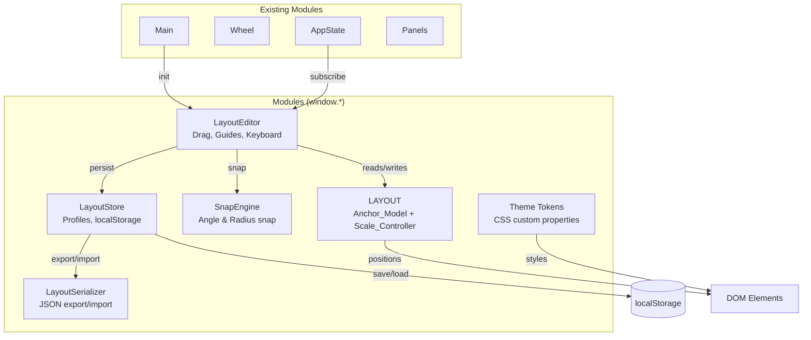
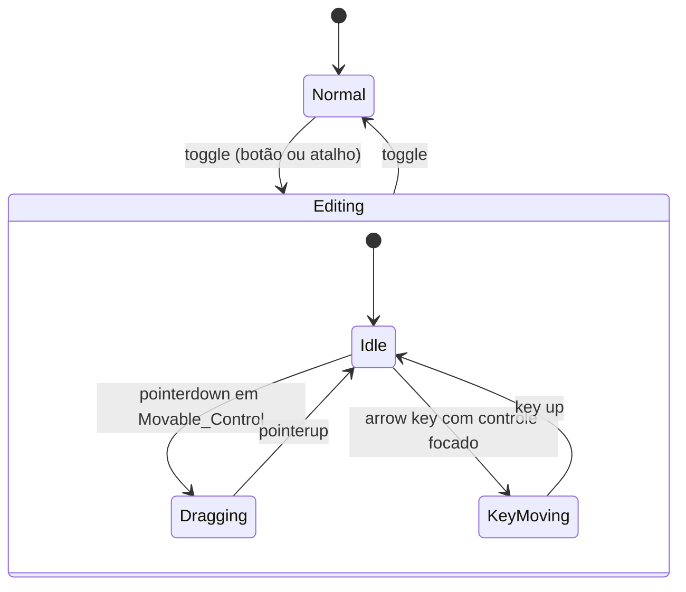

# Design Document: Layout Parity & Editor

## Overview

Este design detalha a implementação de paridade visual com o Figma_Reference_Frame e de um editor de layout por arraste para o painel da demo do Color Wheel. O painel é uma aplicação vanilla JS sem framework nem etapa de build — todo código vive em módulos IIFE (`window.LAYOUT`, `window.AppState`, etc.) carregados por `<script>` no `index.html`.

O trabalho divide-se em dois eixos:

1. **Paridade Visual** — reproduzir a geometria, coordenadas e cores do frame Figma `7NNEGJVNPnbjoNgLeQHheo` nó `1:2`, usando CSS custom properties (`--u`, `--scale`) e o sistema de âncoras já existente em `layout.js`.

2. **Layout Editor** — permitir que o usuário arraste os Movable_Controls ao redor da roda em um Modo_De_Organização, com encaixe, guias, persistência em localStorage e exportação/importação JSON.

A implementação existente já fornece o `Anchor_Model` (funções `anchorToPoint` / `pointToAnchor`) e o `Scale_Controller` (função `computeScale` + `ResizeObserver`). O design aproveita esses alicerces e os estende para o editor.

### Design Decisions

| Decisão | Alternativa Descartada | Justificativa |
|---------|----------------------|---------------|
| Vanilla JS IIFE modules | Framework (React/Svelte) | A demo não tem build step; manter consistência com o código existente |
| CSS `calc(N * var(--u))` para métricas fixas | Inline JS positioning | Métricas fixas (bandas, divisores, tabs) ficam declarativas no CSS; só Movable_Controls usam JS |
| localStorage com JSON.stringify | IndexedDB | Simplicidade proporcional aos dados (< 10 KB por perfil) |
| Snap Engine como função pura | Integrado ao drag handler | Facilita testes de propriedade e idempotência |
| Polar anchors (ângulo + raio) | Cartesian (x, y) | Escala proporcional trivial — basta multiplicar o raio pelo Scale_Factor |

---

## Architecture



### Module Dependency Order (script load)

```
color.js → state.js → layout.js → snap.js → layout-store.js →
layout-serializer.js → layout-editor.js → wheel.js → panels.js →
main.js
```

Os três novos arquivos (`snap.js`, `layout-store.js`, `layout-serializer.js`) e o novo `layout-editor.js` são módulos IIFE que expõem suas APIs em `window.*`.

---

## Components and Interfaces

### 1. Theme_Tokens (CSS Custom Properties)

Já implementado em `styles.css` como `--panel-bg`, `--accent`, etc. Nenhuma mudança necessária — os tokens já correspondem ao Requisito 6.

### 2. Anchor_Model (`window.LAYOUT`)

**Existente.** Funções:

```js
anchorToPoint(anchor, center, scale) → { x, y }
pointToAnchor(point, center, scale) → { angle, radius }
```

**Invariantes:**
- `angle ∈ [0, 360)`, `radius ∈ [0, 700]`
- Round-trip: `anchorToPoint(pointToAnchor(p, c, s), c, s) ≈ p` (dentro de 0.01 unidade)
- Ao mudar a escala, o ângulo permanece idêntico

**Extensão necessária:** Adicionar `normalizeAnchor(anchor)` que clampa ângulo e raio aos intervalos válidos.

```js
// Nova função
function normalizeAnchor(anchor) {
  let angle = ((anchor.angle % 360) + 360) % 360;
  let radius = Math.max(0, Math.min(700, anchor.radius));
  return { angle, radius };
}
```

### 3. Scale_Controller (`window.LAYOUT`)

**Existente.** Função `computeScale(availW)`:

```js
function computeScale(availW) {
  const clamped = Math.min(Math.max(availW, 320), 1200);
  return clamped / 628;
}
```

**Invariantes:**
- `scaleFactor = clamp(width, 320, 1200) / 628`
- Aspect ratio do panel: `height / width === 907 / 628` para qualquer scale
- Para qualquer par de medidas `a, b`: `|a*s/b*s - a/b| / (a/b) ≤ 0.005`

### 4. Snap_Engine (`window.SnapEngine`)

**Novo módulo.** Função pura sem side effects.

```js
window.SnapEngine = {
  /**
   * @param {Anchor} anchor - Anchor raw do arraste
   * @param {Anchor[]} visibleAnchors - Anchors dos outros controles visíveis
   * @param {{ altKey: boolean }} modifiers - Teclas modificadoras ativas
   * @returns {{ anchor: Anchor, snappedAngle: boolean, snappedRadius: boolean, snapRadius?: number }}
   */
  snap(anchor, visibleAnchors, modifiers) { ... }
};
```

**Regras:**
- Se `modifiers.altKey === true`, retorna `anchor` sem alteração
- Encaixe angular: se `|angle - round5(angle)| ≤ 2.5°`, arredonda para múltiplo de 5°
- Encaixe radial: se existe `r` em `visibleAnchors` tal que `|anchor.radius - r| ≤ 6`, arredonda para `r`
- **Idempotência:** `snap(snap(a, v, m), v, m) === snap(a, v, m)`

### 5. Layout_Store (`window.LayoutStore`)

**Novo módulo.** Gerencia perfis em localStorage.

```js
window.LayoutStore = {
  // Dados
  DEFAULT_PROFILE_NAME: 'Padrão',
  
  // API
  getActiveProfile() → LayoutProfile,
  setAnchor(controlId, anchor),
  createProfile(name) → string,       // retorna nome efetivo (com sufixo se duplicado)
  renameProfile(oldName, newName) → boolean,
  activateProfile(name),
  deleteProfile(name),
  resetToDefault(),
  listProfiles() → string[],
  
  // Lifecycle
  init(),          // carrega do localStorage ou aplica default
  subscribe(fn),   // notifica mudanças
};
```

**Formato em localStorage:**

```json
{
  "layout_profiles": {
    "Padrão": { /* anchors from LAYOUT.ANCHORS */ },
    "Meu Layout": { "harmony.1": { "angle": 15, "radius": 260 }, ... }
  },
  "layout_active": "Meu Layout"
}
```

**Regras:**
- Default_Profile é read-only: rename e delete são no-ops com mensagem
- Nomes: 1-40 caracteres; duplicatas recebem sufixo ` (2)`, ` (3)`, etc.
- Salvamento automático em ≤ 500 ms após qualquer `setAnchor`
- Ao carregar, anchors ausentes são preenchidas a partir do Default_Profile
- Ao excluir o perfil ativo, ativa o Default_Profile

### 6. Layout_Serializer (`window.LayoutSerializer`)

**Novo módulo.** Converte entre `LayoutProfile` e texto JSON.

```js
window.LayoutSerializer = {
  FORMAT_VERSION: 1,
  
  /**
   * @param {LayoutProfile} profile
   * @returns {string} JSON text
   */
  exportProfile(profile) { ... },
  
  /**
   * @param {string} jsonText
   * @returns {{ ok: boolean, profile?: LayoutProfile, error?: string, discarded?: number }}
   */
  importProfile(jsonText) { ... },
};
```

**Formato de exportação:**

```json
{
  "version": 1,
  "name": "Meu Layout",
  "controls": {
    "harmony.1": { "angle": 11.36, "radius": 264.2 },
    "harmony.2": { "angle": 25.2, "radius": 265.3 }
  }
}
```

**Regras de validação na importação:**
1. JSON sintaticamente válido → senão rejeita ("texto inválido")
2. `version` === `FORMAT_VERSION` → senão rejeita ("versão não suportada")
3. Cada `angle ∈ [0, 360]`, cada `radius ∈ [0, 700]` → senão rejeita ("valor fora do intervalo")
4. Control IDs desconhecidos → descarta silenciosamente, importa o resto, retorna `discarded` count
5. Ângulos e raios serializados com `toFixed(3)` (máximo 3 casas decimais)

**Round-trip:** Para qualquer perfil válido, `import(export(P)).anchors ≈ P.anchors` dentro de 0.001 unidade.

### 7. Layout_Editor (`window.LayoutEditor`)

**Novo módulo.** Orquestra o Modo_De_Organização.

```js
window.LayoutEditor = {
  isEditing() → boolean,
  toggle(),
  init(),
};
```

**Comportamento:**



**Ao entrar no Modo_De_Organização:**
- Adiciona classe `.layout-editing` ao `#panel`
- Contorno de 1px `accent` em cada `[data-layout]`
- Status bar mostra "Modo de organização"
- `pointerdown` em `[data-layout]` inicia arraste (não dispara ação do controle)
- Tab navega entre controles; arrow keys movem 1u (Shift: 10u)

**Ao arrastar:**
- `pointermove` atualiza posição via `LAYOUT.anchorToPoint` a cada frame
- `pointerup` converte posição final via `LAYOUT.pointToAnchor`, aplica `SnapEngine.snap`, clampa ao painel, grava em `LayoutStore`
- Exibe guias (arco/linha radial) durante snap ativo

**Clamping de limites:**
- `clampAnchorToBounds(anchor, controlSize, scale)` garante que o centro ± metade do diâmetro fique dentro de `[0, 628*scale] × [0, 907*scale]`

**Overlap detection:**
- Após cada drop, verifica distância entre todos os pares de Movable_Controls
- Se `dist(centerA, centerB) < (radiusA + radiusB)`, adiciona classe `.overlap-warn`

---

## Data Models

### Anchor

```typescript
interface Anchor {
  angle: number;   // [0, 360) degrees, 0 = top, clockwise
  radius: number;  // [0, 700] Reference_Space units from Wheel_Center
}
```

### LayoutProfile

```typescript
interface LayoutProfile {
  name: string;                          // 1-40 characters
  anchors: Record<string, Anchor>;       // controlId → Anchor
}
```

### LayoutExport (JSON format)

```typescript
interface LayoutExport {
  version: number;                       // FORMAT_VERSION (currently 1)
  name: string;
  controls: Record<string, { angle: number; radius: number }>;
}
```

### Movable_Control IDs (from LAYOUT.ANCHORS)

```
harmony.1, harmony.2, harmony.3, harmony.4, harmony.5, harmony.6,
sat.gamutmask, sat.shape, hex.field,
history.redo, history.undo,
rail.dial.temperature, rail.dial.brightness, rail.lumlock, rail.valuecheck,
swatch.fg, swatch.bg, swatch.swap
```

Total: 18 Movable_Controls.

---

## Correctness Properties

*A property is a characteristic or behavior that should hold true across all valid executions of a system — essentially, a formal statement about what the system should do. Properties serve as the bridge between human-readable specifications and machine-verifiable correctness guarantees.*

### Property 1: Anchor ↔ Screen Coordinate Round-Trip

*For any* point `(x, y)` within the panel bounds, *and any* scale factor in `[320/628, 1200/628]`, converting the point to an Anchor via `pointToAnchor` and back to a point via `anchorToPoint` SHALL reproduce the original point within 0.01 Reference_Space units.

**Validates: Requirements 3.2, 3.3, 3.4**

### Property 2: Hidden Control Anchor Preservation

*For any* Movable_Control and *any* sequence of show/hide toggles, the stored Anchor of that control SHALL remain unchanged regardless of its visibility state.

**Validates: Requirements 3.6**

### Property 3: Scale Factor Clamping

*For any* available width value (including values below 320 and above 1200), `computeScale(width)` SHALL return `clamp(width, 320, 1200) / 628`.

**Validates: Requirements 7.1, 7.2**

### Property 4: Proportional Scaling Invariant

*For any* two Reference_Space measurements `a` and `b` (where `b > 0`) *and any* Scale_Factor `s`, the rendered ratio `(a*s) / (b*s)` SHALL equal `a/b` within 0.5%, and the panel aspect ratio SHALL equal `907/628`.

**Validates: Requirements 7.4, 7.5**

### Property 5: Controls Within Panel Bounds

*For any* valid Anchor (angle ∈ [0,360), radius ∈ [0,700]) *and any* Scale_Factor in the permitted range, after applying `clampAnchorToBounds`, the control's rendered rectangle SHALL be entirely within the panel's rendered rectangle.

**Validates: Requirements 7.6, 8.6**

### Property 6: Overlap Detection Correctness

*For any* two Movable_Controls with given center positions and sizes, the overlap detection function SHALL report overlap if and only if the Euclidean distance between their centers is less than the sum of their radii.

**Validates: Requirements 8.8**

### Property 7: Angle Snap Threshold

*For any* angle `θ`, the Snap_Engine SHALL round `θ` to the nearest multiple of 5° if and only if `|θ - nearest5(θ)| ≤ 2.5°`. Otherwise it SHALL return `θ` unchanged.

**Validates: Requirements 9.1**

### Property 8: Radius Snap to Nearest Visible Control

*For any* radius `r` and *any* set of visible control radii `R`, the Snap_Engine SHALL round `r` to the `r'` in `R` closest to `r` if and only if `|r - r'| ≤ 6` units. Otherwise it SHALL return `r` unchanged.

**Validates: Requirements 9.2**

### Property 9: Snap Idempotence

*For any* Anchor `a` and *any* set of visible anchors `V`, applying `snap(snap(a, V, m), V, m)` SHALL produce the same result as `snap(a, V, m)`.

**Validates: Requirements 9.5**

### Property 10: Alt Key Disables Snap

*For any* Anchor `a` and *any* set of visible anchors, when `modifiers.altKey === true`, `snap(a, V, { altKey: true })` SHALL return `a` unchanged.

**Validates: Requirements 9.6**

### Property 11: Profile Save/Load Round-Trip

*For any* valid LayoutProfile (with valid name and valid anchors for all 18 controls), saving to localStorage and then loading SHALL produce a profile whose anchors are identical to the original. If some anchors are missing from the stored data, the missing ones SHALL be filled from the Default_Profile.

**Validates: Requirements 10.3, 10.5**

### Property 12: Name Validation and Deduplication

*For any* string of 1-40 characters, `createProfile` SHALL accept it. *For any* string of 0 or >40 characters, `createProfile` SHALL reject it. *For any* name that already exists, `createProfile` SHALL produce a unique name by appending a numeric suffix, and the result SHALL differ from all existing names.

**Validates: Requirements 10.6, 10.8**

### Property 13: Reset Restores Default

*For any* modified LayoutProfile (regardless of which anchors were changed), after `resetToDefault()`, every anchor in the active profile SHALL equal the corresponding anchor in the Default_Profile.

**Validates: Requirements 10.9**

### Property 14: Export/Import Round-Trip

*For all* valid LayoutProfiles, exporting to JSON and then importing the resulting text SHALL produce a profile whose anchors are equal to the original within 0.001 units for both angle and radius, and whose set of control IDs is identical to the original.

**Validates: Requirements 11.1, 11.2, 11.4**

### Property 15: Invalid Import Rejection

*For any* text that is (a) not valid JSON, (b) valid JSON with an unknown version, or (c) valid JSON with any angle outside [0,360] or radius outside [0,700], `importProfile` SHALL return `{ ok: false }` and SHALL NOT modify the active LayoutProfile.

**Validates: Requirements 11.5, 11.6, 11.7**

### Property 16: Partial Import with Unknown Control IDs

*For any* valid JSON containing a mix of known and unknown control IDs, `importProfile` SHALL import all entries with known IDs, discard entries with unknown IDs, and report the count of discarded entries.

**Validates: Requirements 11.8**

### Property 17: Keyboard Nudge

*For any* selected Movable_Control with Anchor `(θ, r)`, pressing an arrow key SHALL change the control's screen position by exactly `step` Reference_Space units in the key's direction (where `step` = 1 without Shift, 10 with Shift), and the resulting Anchor SHALL be the `pointToAnchor` of the new screen position.

**Validates: Requirements 12.2, 12.3**

---

## Error Handling

| Cenário | Comportamento | Mensagem ao Usuário |
|---------|---------------|---------------------|
| localStorage indisponível | Opera apenas em memória; avisa na status bar | "Armazenamento indisponível — arranjo não será salvo" |
| Importação JSON malformada | Rejeita, preserva perfil ativo | "Texto inválido — verifique a formatação JSON" |
| Versão de formato desconhecida | Rejeita, preserva perfil ativo | "Versão não suportada — exporte de uma versão atual" |
| Valores fora do intervalo | Rejeita integralmente | "Valor fora do intervalo permitido (ângulo 0-360, raio 0-700)" |
| IDs de controle desconhecidos | Importa parcialmente, informa descartados | "N entrada(s) descartada(s) por identificador desconhecido" |
| Rename/delete do Default_Profile | No-op | "O perfil padrão é fixo e não pode ser renomeado ou excluído" |
| Nome de perfil vazio ou >40 chars | Rejeita operação | "Nome deve ter de 1 a 40 caracteres" |
| Controle arrastado fora dos limites | Clampa à borda mais próxima | Nenhuma mensagem (feedback visual implícito) |
| Overlap de controles | Mantém posição, exibe aviso visual | Contorno `warn` nos controles sobrepostos |

---

## Testing Strategy

### Unit Tests (example-based)

Focam nos requisitos visuais (Requisitos 1-6) e nos comportamentos de UI específicos:

- Verificar que os tokens CSS correspondem aos valores hex do Requisito 6
- Verificar dimensões e posições fixas do Panel (bandas, divisores, sliders, tabs)
- Verificar coordenadas de referência de cada satélite (Requisito 4)
- Verificar comportamento do toggle do Modo_De_Organização (enter/exit)
- Verificar Tab navigation e acessibilidade (aria-labels, live regions)
- Verificar fallback ao Default_Profile quando localStorage está vazio
- Verificar proteção do Default_Profile contra rename/delete

### Property-Based Tests

Library: **fast-check** (JavaScript, works with vanilla JS modules via Node test runner)

Configuration: minimum 100 iterations per property.

Tag format: `Feature: layout-parity-editor, Property {N}: {title}`

Each correctness property above maps to one property-based test:

1. **Anchor round-trip** — gera pontos aleatórios e scale factors
2. **Hidden anchor preservation** — gera sequências de show/hide
3. **Scale clamping** — gera larguras aleatórias incluindo extremos
4. **Proportional scaling** — gera pares de medidas e scales
5. **Controls within bounds** — gera anchors e scales aleatórios
6. **Overlap detection** — gera pares de centros e tamanhos
7. **Angle snap** — gera ângulos aleatórios em [0, 360)
8. **Radius snap** — gera raios e conjuntos de raios visíveis
9. **Snap idempotence** — gera anchors e conjuntos de visíveis
10. **Alt disables snap** — gera anchors com altKey=true
11. **Profile save/load** — gera perfis com subsets de anchors
12. **Name validation** — gera strings de comprimentos variados
13. **Reset restores default** — gera perfis modificados aleatoriamente
14. **Export/import round-trip** — gera perfis válidos completos
15. **Invalid import rejection** — gera textos inválidos (não-JSON, versão errada, valores fora)
16. **Partial import** — gera JSON com mix de IDs válidos e inválidos
17. **Keyboard nudge** — gera anchors e sequências de teclas

### Integration Tests

- Verificar que `ResizeObserver` recalcula escala em ≤ 100 ms (Requisito 7.3)
- Verificar que `setAnchor` grava em localStorage em ≤ 500 ms (Requisito 10.2)
- Verificar interação drag completa end-to-end (pointerdown → pointermove → pointerup)
